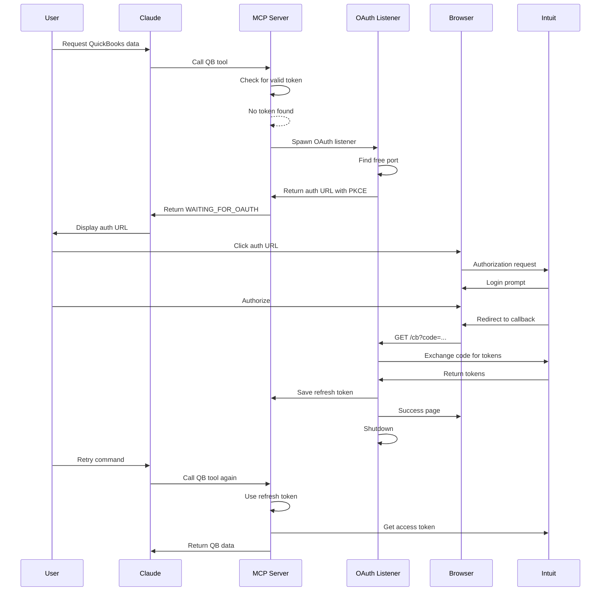

# OAuth Flow Architecture and Security Considerations

## Overview

This document outlines the OAuth 2.0 + PKCE implementation for the QuickBooks MCP Desktop Extension, addressing the unique constraints of running within Claude Desktop.

## Architecture Components

### 1. DXT Extension (Client)
- Runs within Claude Desktop's sandboxed environment
- Cannot spawn web servers or listen on ports
- Communicates via stdio with Claude Desktop
- Has access to environment variables set by user_config

### 2. OAuth Listener (Temporary)
- Spawned on-demand when authentication needed
- Finds available port dynamically
- Implements PKCE for enhanced security
- Auto-terminates after successful auth

### 3. Token Manager
- Handles token lifecycle (access & refresh)
- Integrates with dxt.saveConfig() when available
- Falls back to secure file storage
- Automatic refresh before expiration

## OAuth Flow Sequence



## Security Architecture

### 1. PKCE (Proof Key for Code Exchange)
- **Code Verifier**: 128-character random string (base64url)
- **Code Challenge**: SHA256(verifier) encoded base64url
- **Purpose**: Prevents authorization code interception attacks
- **Implementation**: Required for public clients (no client secret in browser)

### 2. Token Storage Security

#### Phase 1: File-Based Storage
```typescript
// Encrypted at rest using OS-specific encryption
tokens_production.json  // Production tokens
tokens_sandbox.json     // Sandbox tokens
```

#### Phase 2: DXT Secure Storage
```typescript
// Using OS keychain via dxt.saveConfig()
await dxt.saveConfig({
  qb_refresh_token: encryptedToken
});
```

### 3. Environment Isolation
- Separate tokens for sandbox/production
- Environment determined by `QUICKBOOKS_PRODUCTION` flag
- Different OAuth apps for each environment

### 4. Redirect URI Security

#### Sandbox Environment
- `http://localhost:{dynamic_port}/cb`
- HTTP acceptable for local development
- Dynamic port prevents conflicts

#### Production Environment  
- `https://127-0-0-1.sslip.io/cb`
- HTTPS required by Intuit
- sslip.io provides valid SSL certificate
- Resolves to 127.0.0.1 (localhost)

## Security Considerations

### 1. Token Handling
- **Never log tokens**: Use redacted logging for security
- **Minimize token exposure**: Only pass tokens when necessary
- **Token rotation**: Handle Intuit's refresh token rotation
- **Token expiry**: Proactive refresh before expiration

### 2. Authentication State
- **Single active session**: One OAuth flow at a time
- **Timeout handling**: 5-minute timeout for auth completion
- **Error recovery**: Clear messaging for auth failures

### 3. Network Security
- **Local only**: OAuth listener only accepts localhost connections
- **Port validation**: Ensure listener binds to 127.0.0.1
- **HTTPS enforcement**: Production requires HTTPS redirect

### 4. Process Security
- **Clean shutdown**: Listener always terminates after auth
- **No persistent servers**: Reduces attack surface
- **Process isolation**: Each auth flow is independent

## Implementation Security Checklist

- [ ] PKCE implementation with 128+ character verifier
- [ ] SHA256 challenge generation
- [ ] Secure random generation using crypto.randomBytes
- [ ] Token storage encryption
- [ ] Refresh token rotation handling
- [ ] Proper error messages (no token leakage)
- [ ] Localhost-only binding for OAuth listener
- [ ] Automatic listener shutdown
- [ ] Request state validation
- [ ] CSRF protection via state parameter

## Error Handling

### Security-Safe Error Messages
```typescript
// Bad: Exposes internal details
"Failed to refresh token: invalid_grant - Refresh token ARB123... has expired"

// Good: Generic user-facing message
"Authentication expired. Please reconnect to QuickBooks."
```

### Recovery Strategies
1. **Expired tokens**: Trigger new OAuth flow
2. **Network errors**: Retry with exponential backoff
3. **Invalid state**: Clear tokens, start fresh
4. **Rate limits**: Queue and retry after delay

## Compliance Notes

1. **OAuth 2.0 Compliance**: Follows RFC 6749
2. **PKCE Compliance**: Implements RFC 7636
3. **Intuit Requirements**: 
   - HTTPS for production
   - Proper scope requests
   - Token refresh within 100 days

## Future Enhancements

1. **Token Encryption**: Add additional encryption layer
2. **Audit Logging**: Track all auth events
3. **Multi-Account**: Support multiple QB companies
4. **Biometric Auth**: Integrate with OS biometric APIs